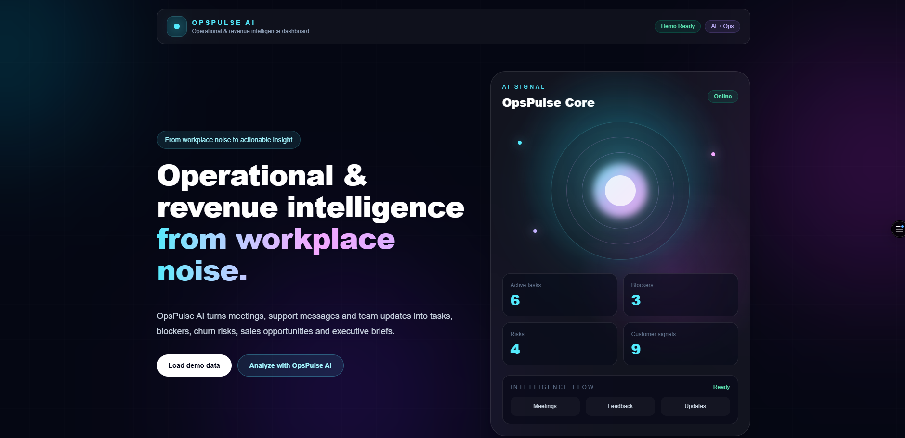
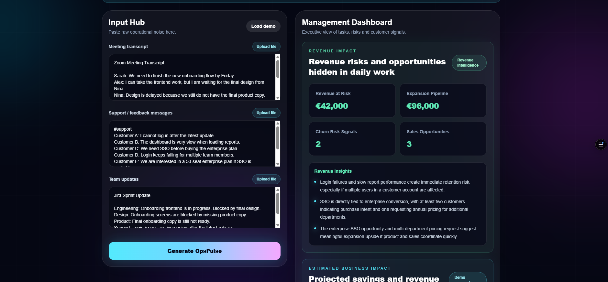
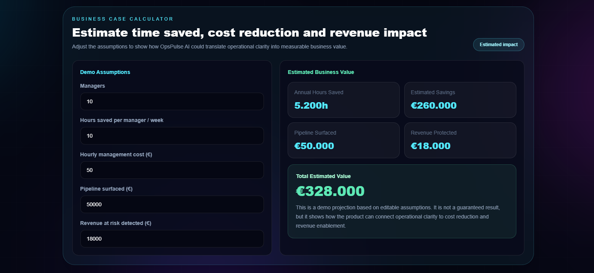
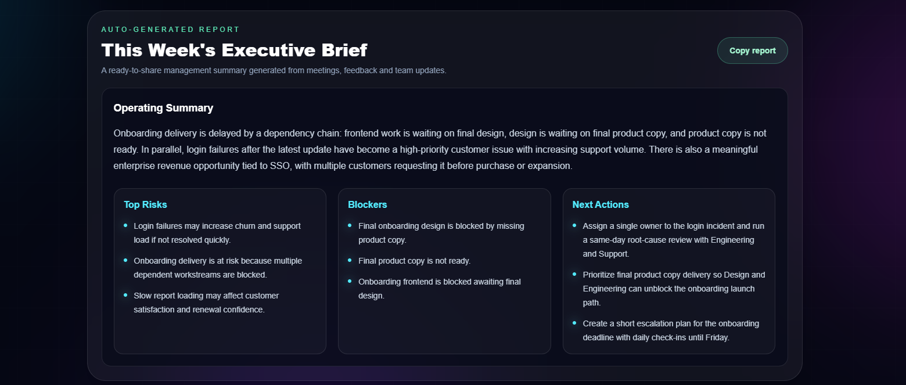

# OpsPulse AI

**Operational & Revenue Intelligence Dashboard**

**Live Demo:** https://opspulse-ai-green.vercel.app

**Tagline:** From workplace noise to actionable insight.

OpsPulse AI turns meeting transcripts, support messages and team updates into clear tasks, blockers, churn risks, sales opportunities, revenue insights, estimated business impact, a business case calculator and executive briefs.

It helps teams understand what is happening across the company, what is blocked, what could hurt revenue, how much time could be saved and what management should do next.

---

## Screenshots

### Landing View


### Management Dashboard


### Business Case Calculator


### Executive Brief


---

## Problem

Modern teams generate important business signals every day across meetings, support conversations, customer feedback and team updates.

But those signals are usually scattered across different tools and formats.

As a result, managers often miss:

- important decisions
- action items
- task owners
- blockers
- customer complaints
- churn risks
- sales opportunities
- revenue-impacting issues
- repeated operational problems
- measurable business value hidden in daily work

This creates operational noise, slows down decision-making and can cause teams to miss both risks and revenue opportunities.

---

## Solution

OpsPulse AI analyzes unstructured workplace inputs and converts them into a structured operational and revenue intelligence dashboard.

The app extracts:

- executive summary
- decisions
- action items
- owners
- deadlines
- blockers
- risks
- customer feedback categories
- revenue at risk
- expansion opportunities
- churn risk signals
- estimated business impact
- business value calculations
- recommended management actions
- ready-to-copy executive brief

---

## Why It Matters

OpsPulse AI is not only a productivity tool.

It helps teams improve operational efficiency and protect revenue by surfacing business-critical signals hidden inside daily work.

The dashboard helps management answer:

- What is the team working on?
- What is blocked?
- What risks are emerging?
- Which customer issues are repeating?
- Which issues could create churn?
- Which messages contain sales opportunities?
- What is the estimated business impact?
- What is the estimated total business value?
- What should leadership do next?

---

## Demo Flow

1. Open the live demo.
2. Click **Load demo data**, use the integration-ready import cards or upload a text-based file.
3. Review the meeting transcript, support messages and team updates.
4. Click **Generate OpsPulse**.
5. View the management dashboard.
6. Review revenue impact and estimated business impact.
7. Use the **Business Case Calculator** to adjust assumptions and estimate total business value.
8. Review team load, risks and recommended actions.
9. Copy the auto-generated executive brief.

---

## Core Features

### Meeting Intelligence

Extracts decisions, action items, owners, deadlines, blockers and risks from meeting transcripts.

### Feedback Intelligence

Classifies customer and support messages into categories such as:

- bug
- feature request
- complaint
- urgent issue
- sales opportunity
- praise

### Operational Dashboard

Shows:

- active tasks
- blocked tasks
- at-risk work
- team load map
- customer signal mix
- top risks
- recommended actions

### Revenue Intelligence

Surfaces business impact from daily communication, including:

- revenue at risk
- expansion pipeline
- churn risk signals
- sales opportunities
- revenue-related insights

### Estimated Business Impact

Projects business value using demo assumptions, including:

- time saved per manager
- annual hours saved
- estimated annual productivity savings
- pipeline surfaced from customer messages

Example demo assumptions:

- 10 managers save 10 hours per week
- estimated fully loaded management cost of €50/hour
- projected annual productivity savings of €260,000
- estimated pipeline surfaced of €50,000

These numbers are framed as estimated demo projections, not guaranteed results.

### Business Case Calculator

OpsPulse AI includes an interactive business case calculator that helps teams estimate the value of operational intelligence.

Users can adjust assumptions such as:

- number of managers
- hours saved per manager per week
- hourly management cost
- pipeline surfaced
- revenue at risk detected

The calculator then estimates:

- annual hours saved
- estimated annual productivity savings
- pipeline surfaced
- revenue protected
- total estimated business value

This directly connects the product to time savings, cost reduction and revenue enablement.

### Executive Brief

Generates a ready-to-copy management report that can be shared with leadership or the team.

The brief includes:

- summary
- revenue impact
- business impact
- top risks
- blockers
- recommended actions
- action items

### File Upload

OpsPulse AI supports uploading text-based workplace files, including:

- `.txt`
- `.csv`
- `.md`
- `.json`
- `.vtt`

This allows teams to upload exported meeting transcripts, support tickets or weekly updates without manually pasting everything.

### Integration-Ready Import Hub

The MVP includes simulated imports for:

- Slack support messages
- Zoom meeting transcripts
- Jira sprint updates

For the hackathon demo, these imports use mock data. In production, they can be replaced with real API connectors.

---

## Implementation Approach

For the hackathon MVP, OpsPulse AI supports:

- manual paste input
- text-based file upload
- simulated Slack, Zoom and Jira imports
- AI-ready backend analysis route
- fallback demo mode for reliable presentation

In a production environment, companies would not need to manually copy conversations. OpsPulse AI would connect to approved workplace systems such as Slack, Zoom, Jira, Zendesk, Intercom or HubSpot.

Companies would choose which channels, projects or ticket queues to analyze. OpsPulse AI would then automatically process approved inputs, extract operational and revenue signals, and update the dashboard on a daily or weekly basis.

---

## Business Impact

OpsPulse AI is designed to create business value in three ways:

### 1. Save Time

By automatically turning meetings, support messages and team updates into structured summaries, tasks and executive briefs, OpsPulse AI reduces manual reporting and follow-up work.

Example demo scenario:

```text
10 managers × 10 hours saved per week × 52 weeks = 5,200 hours saved per year
```

### 2. Cut Costs

Using an estimated fully loaded management cost of €50/hour:

```text
5,200 hours × €50/hour = €260,000 estimated annual productivity savings
```

### 3. Generate Value

OpsPulse AI surfaces revenue signals hidden in customer messages and team updates.

Example demo scenario:

```text
€50,000 potential expansion pipeline surfaced
€18,000 revenue at risk detected
€328,000 total estimated value
```

These numbers are demo assumptions and are not guaranteed outcomes. They show how the product can connect operational clarity to measurable business impact.

---

## Tech Stack

- Next.js
- React
- TypeScript
- Tailwind CSS
- OpenAI API
- GitHub
- Vercel

---

## AI Mode

OpsPulse AI is designed to use the OpenAI API for live analysis.

If API credits are unavailable, the app automatically uses demo mode with pre-generated analysis. This keeps the hackathon demo stable and reliable.

To enable live AI analysis, create a `.env.local` file:

```env
OPENAI_API_KEY=your_openai_api_key_here
```

An example environment file is provided in `.env.example`.

---

## Run Locally

Install dependencies:

```bash
npm install
```

Start the development server:

```bash
npm run dev
```

Open the app:

```text
http://localhost:3000
```

---

## Project Structure

```text
opspulse-ai
├── app
│   ├── page.tsx
│   └── api
│       └── analyze
│           └── route.ts
├── public
├── .env.example
├── package.json
└── README.md
```

If the project uses a `src` directory, the main files are located in:

```text
src/app/page.tsx
src/app/api/analyze/route.ts
```

---

## Privacy & Ethics

OpsPulse AI is not designed for employee surveillance.

It analyzes approved business inputs such as meeting transcripts, support messages and team updates to surface operational and revenue signals.

In a production environment, companies should configure exactly which channels, projects and data sources are allowed to be analyzed.

---

## Hackathon Positioning

OpsPulse AI is an operational and revenue intelligence MVP.

It does not track employees. It analyzes existing business inputs and turns them into structured insight.

The goal is to help teams reduce operational chaos, detect blockers earlier, surface customer issues, identify churn risks and uncover revenue opportunities before they are missed.

---

## One-Sentence Pitch

OpsPulse AI turns meetings, support messages and team updates into tasks, blockers, churn risks, sales opportunities, business value estimates and executive insights.

---

## Future Improvements

- Real Slack integration
- Real Zoom transcript import
- Real Jira connector
- Zendesk and Intercom support
- HubSpot or Salesforce CRM integration
- Authentication
- Team workspace support
- Historical trend tracking
- PDF export
- Push tasks to Jira, Linear or Asana
- Revenue impact scoring based on real customer value
- ROI calculator connected to real company metrics
- Business impact reports by team or department
- Automated weekly executive reports

---

## Summary

OpsPulse AI transforms workplace noise into an actionable operating and revenue dashboard for modern teams.